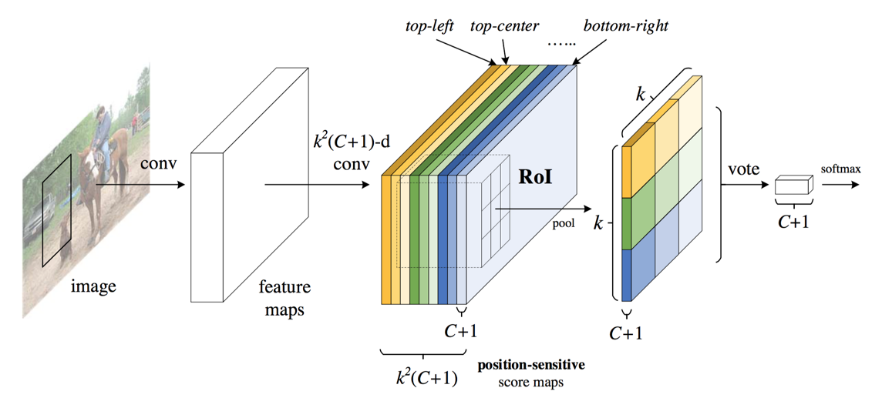
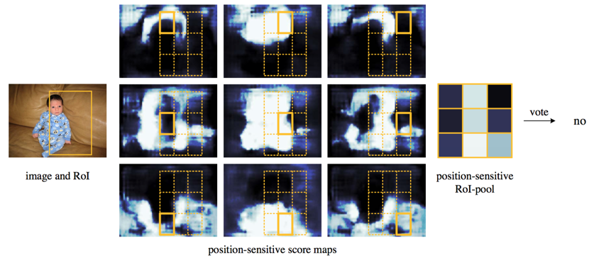

# R-FCN: Object Detection via Region-based Fully Convolutuional Networks

## 简介：

位移不变性是卷积网络一个重要的特征，该特征使得卷积网格在图像分类任务上取得了非常好的效果，所谓唯一不变性，是指图片中物体的位置对图片的分类没有影响。但是在物体检测的场景中，我们需要知道检测物体的具体位置，这时候我们需要网络对物体的位置非常敏感，即我们需要网络具有“位移可变性”。R-FCN  的提出便是解决分类任务中位移不变性和检测任务中位移可变性直接的矛盾的。

同时，作者分析了Faster R-CNN  存在的性能瓶颈，即ROI之后使用Fast R-CNN  对RPN提取的候选区域进行分类和位置精校。在R-FCN中，ROI之后便不存在可学习的参数，从而将Faster-RCNN的速度提高了2.5-20倍。

## 1. 动机

在R-CNN系列论文中，物体检测一般分成两步：

1. 提取候选区域；
2. 候选区域分类和位置精校。

在R-FCN之前，state-of-the-art的Faster-RCNN使用RPN网络进行候选区域（Proposal Region）选择，然后再使用Fast R-CNN进行分类。在Faster R-CNN中，首先使用ROI层将不同大小的候选区域归一化到统一大小，之后接若干个全连接层，最后使用一个多任务作为损失函数。多任务包含两个子任务：

1. softmax的分类任务；
2. 用于位置精校的回归任务

Faster R-CNN之所以这样做主要是因为其使用了VGG  作为特征提取器。在第一章中，我们了解到VGG之后的GoogLeNet  和ResNet  均是使用了全卷积的结构，即使用$$1\times1$$卷积代替全连接。$$1\times1$$卷积具备全连接层增加非线性性的作用，同时还保证了特征点的位置敏感性。可见在物体检测任务中引入$$1\times1$$卷积会非常有帮助的。

在Faster R-CNN中，为了保证特征的“位移敏感性”，作者根据RPN提取了约2000个候选区域，然后使用全连接层计算损失函数，然而候选区域有大量的特征冗余，造成了一部分计算资源的浪费。

R-FCN采用了和Faster R-CNN相同的过程，在R-FCN中做了如下改进

1. 模仿FCN，R-FCN采用了全卷积的结构；
2. R-FCN的两个阶段的网络参数全部共享；
3. 使用位置敏感网络产生检测框；
4. 位置敏感网络无任何可学习的参数。

R-FCN的结构如图1

#### 图1：R-FCN核心思想

在图1中，$$C$$表示物体检测中物体的类别数目。在R-FCN中，一个ROI会被分成$$k\times k$$个bin。下面我们来详细解析R-FCN。

## 2. R-FCN详解

R-FCN采用了和Faster R-CNN相同的框架（图2），关于Faster R-CNN的解释，可以参考论文或者我的[解析](https://senliuy.gitbooks.io/advanced-deep-learning/content/chapter1/faster-r-cnn-towards-real-time-object-detection-with-region-proposal-networks.html)。

#### 图2：R-FCN流程图$$x = y$$

### 2.1 骨干架构（backbone architecture）

R-FCN使用的是残差网络的ResNet-101\[6\]结构，ResNet-101采用的是100层卷积+Global Averaging Pooling（GAP）+fc分类器的结构，ResNet101卷积的最后一层的Feature Map的个数是2048。在R-FCN中，去掉了ResNet的GAP层和fc层，并在最后一个卷积层之后使用1024个$$1\times1\times2048$$卷积降维到1024-d，然后再使用$$k^2\times(C+1)$$个$$1\times1\times1024-d$$的卷积生成$$k^2\times(C+1)-d$$的位置敏感卷积层。其中ResNet部分使用在ImageNet上训练好的模型作为初始化参数。

### 2.2 位置敏感网络

图1和图2中ResNet之后接的便是位置敏感网络。该层的大小和ResNet-101最后一层的大小相同，维度是$$k^2\times(C+1)$$。$$C+1$$为类别数，表示$$C$$类物体加上1类背景。k是一个超参数，表示把ROI划分grid的单位，一般情况下，$$k=3$$。在R-FCN中，一个ROI区域会被等比例划分成一个$$k\times k$$的grid，每个位置为一个bin，分别表示该grid对应的物体的敏感位置（左上，正上，右上，正左，正中，正右，左下，正下，右下）编码（图3）。

#### 图3：图解位置敏感ROI Pooling过程\(k=3\)

对于一个尺寸为$$w\times h$$的ROI区域，每个bin的大小约为$$\frac{w}{k} \times \frac{h}{k}$$。在第$$(i,j)^{th}$$ bin中$$(0<=i,j<k)$$中，定义了一个只作用于该bin的位置敏感ROI池化（position-sensitive ROI pooling）,即求位置敏感分值图（position-sensitive score mpas）中每个bin的均值

$$
r_c(i,j|\theta) = \frac{1}{n} \sum_{(x,y)\in bin(i,j)} z_{i,j,c}(x+x_0, y+y_0 | \theta)
$$

在上式中，$$\theta$$表示整个网络所有需要学习的参数，$$r_c(i,j|\theta)$$表示第$$c$$类物体在第$$(i,j)$$个bin处的响应值，$$z_{i,j,c}(x+x_0, y+y_0 | \theta)$$表示在位置敏感分值图中每个bin对应的横跨特征图中$$\lfloor i\frac{w}{k}\rfloor \leq x < \lceil (i+1)\frac{w}{k}\rceil$$和$$\lfloor i\frac{h}{k}\rfloor \leq y < \lceil (i+1)\frac{h}{k}\rceil$$的部分特征值。

如图3所示，一个维度为$$w\times h\times[k^2\times(C+1)]$$的ROI区域可以展开成$$k^2$$个$$w\times h\times(C+1)$$个ROI区域，每个ROI区域的第$$(i,j)$$个grid对应物体的一个不同的敏感位置，这样我们可以提取$$k^2$$个维度为$$\frac{w}{k}\times \frac{h}{k} \times (C+1)$$的分值图，每个分值图求均值之后再整合到一起便得到了一个$$k^2\times(C+1)$$的位置敏感分值。对该位置敏感分值的$$k^2$$个区域求均值得到一个$$1\times1\times(C+1)$$的向量，使用softmax函数（注意不是softmax分类器）便可以得到每个类别的概率值。至此，R-FCN的分类任务介绍完毕。

现在开始介绍分类任务，在ResNet101之后，使用4个$$1\times1\times1024$$卷积得到一个维度维4的卷积。该卷积层对应的ROI区域根据物体的位置分成$$k^2$$个bin，这样便得到了一个$$4\times k^2$$的特征向量，物体的位置信息$$(x,y,w,h)$$通过平均或者投票的方式可以得到。注意R-FCN得到的位置信息和物体的类别没有关系，这一点和Faster R-CNN是不同的。

### 2.3 R-FCN的训练

R-FCN也是采用了分类和回归的多任务损失函数：

$$
L(s,t_{x,y,w,h}) = L_{cls} + \lambda[c^*>0]L_{reg}(t,t*)
$$

其中$$c^*$$表示分类得到的ROI区域的类别；$$[c^*>0]$$表示如果括号内的判断满足，结果为1，否则结构为1；$$\lambda$$为多任务的比重，是一个需要根据模型的收敛效果调整的超参数；$$L_{cls}$$为softmax分类损失函数，$$L_{reg}$$为bounding box回归损失函数。

### 2.4 R-FCN结果可视化

图4中的可视化展示了R-FCN的bin的工作原理，如果ROI区域能够比较精确的框柱物体的位置（图4.a），那么每个bin对应的Feature Map都应该能得到非常高的响应；如果ROI区域（图4.b）的定位的不是非常准确，那么部分bin的响应就不是非常明显，那么通过投票或者求均值的方法就能筛选出更精确的检测框。

图4：R-FCN可视化

\(a\)

\(b\)

