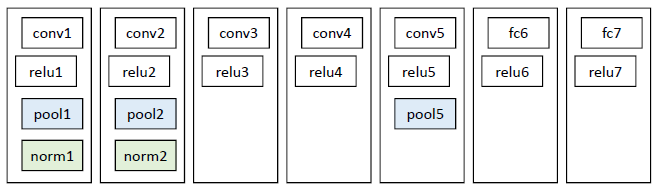

# Rich feature hierarchies for accurate object detection and semantic segmentation

## Rich feature hierarchies for accurate object detection and semantic segmentation

tags: R-CNN, Object Detection

## 简介

论文发表于2014年，自2012年之后，物体检测的发展开始变得缓慢，一个重要的原因是基于计算机视觉的方法（SIFT，HOG）进入了一个瓶颈期。生物学上发现人类的视觉是一个多层次的流程，而SIFT或者HOG只相当于人类视觉的第一层，这是导致瓶颈期的一个重要原因。

2012年，基于随机梯度下降的卷机网络在物体识别领域的突破性进展充分展现了CNN在提取图片特征上的巨大优越性 。CNN的一个重要的特点是其多层次的结构更符合人类的生物特征。

但大规模深度学习网络的应用对数据量提出了更高的需求。在数据量稀缺的数据集上进行训练，迭代次数太少会导致模型拟合能力不足，迭代次数太多会导致过拟合。为了解决该问题，作者使用了在海量数据上的无监督学习的预训练加上稀缺专用数据集的fine-tune。

在算法设计上，作者采用了 “Recognition Using Regions” 的思想，R-CNN 使用Selective Search 提取了2k-3k个候选区域，对每个候选区域单独进行特征提取和分类器训练，这也是R-CNN命名的由来。

同时，为了提高检测精度，作者使用了岭回归对检测位置进行了精校。以上方法的使用，使得算法在PASCAL数据集上的检测到达了新的高度。

## 算法详解

### 1. R-CNN流程

R-CNN测试过程可分成五个步骤

1. 使用Selective Search在输入图像上提取候选区域;
2. 使用CNN对每个wrap到固定大小（227 \* 227）的候选区域上提取特征;
3. 将CNN得到的特征Pool5层的特征输入N个（类别数量）SVM分类器对物体类别进行打分
4. 根据Pool5的特征输入岭回归器进行位置精校。
5. 使用贪心的非极大值抑制（NMS）合并候选区域，得到输出结果

所以，R-CNN的训练过程也涉及

* CNN特征提取器
* SVM分类器
* 岭回归位置精校器

三个模块的学习。

论文中给出的图（图1）没有画出回归器部分。


## 2. 候选区域提取

R-CNN输入网络的并不是原始图片，而是经过Selective Search选择的候选区域。

1. Selective Search 使⽤  的⽅法，将图像分成若⼲个⼩区域
2. 计算相似度，合并相似度较⾼的区域，直到⼩区域全部合并完毕
3. 输出所有存在过的区域，即候选区域 如下面伪代码：

**Algorithm 1: Hierarchial Grouping Algorithm**

```text
Input: (color) image
Output: Set of object location hypotheses L

Obtain initial regions R = {r1, ..., r13}
Initial similarity set S = []

foreach Neighbouring region pair(ri, rj) do
    Calculate similarity s(ri, rj)
    S.insert(s(ri, rj))

while S != [] do
    Get highest similarity s(ri, rj) = max(S)
    Merge corresponding regions ri = Union(ri, rj)
    Remove similarities regarding ri: S = S.delete(ri, r*)
    Remove similarities regarding sj: S = S.delete(r*, rj)
    Calculate similarity set St between rt and its neighbours
    S = Union(S, St)
    R = Union(R, rt)

Extact object location boxes L from all regions in R
```

Selective Search 伪代码 区域的合并规则是：

1. 优先合并颜⾊相近的
2. 优先合并纹理相近的
3. 优先合并合并后总⾯积⼩的
4. 合并后，总⾯积在其BBOX中所占⽐例⼤的优先合并

图2是通过Selective Search得到的一候选区域


### 3. 训练数据准备

#### 3.1 CNN的数据准备

1. 预训练：使用ILSVRC 2012的数据，训练一个N类任务的分类器。在该数据集上，top-1的error是2.2%，达到了比较理想的初始化效果。
2. 微调：每个候选区域是一个N+1类的分类任务（在PASCAL上，N=20；ILSVRC，N=200）。表示该候选区域是某一类或者是背景。当候选区域和某一类物体的Ground Truth box的重合度（IoU）大于0.5时，该样本被判定为正样本，否则为负样本。

#### 3.2 SVM分类器的数据准备

**标签**

由于SVM只能做二分类，所以在N分类任务中，作者使用了N个SVM分类器。对于第K类物体，与该物体的Ground Truth box的IoU大于0.3的视为正样本，其余视为负样本。论文中指出，0.3是通过Grid Search得到的最优阈值。

通过实验结果选取IoU阈值是一方面。作者在附录B中给了解释，其实不太理解其思路，希望明白的大神能够帮忙给出解释。

**特征**

作者通过对比CNN网络中的Pool5，fc6，fc7三层的特征在PASCAL VOC 2007数据集上的表现，发现Pool5层得到的error更低，所以得出结论Pool5更能表达输入数据的特征，所以SVM使用的是从Pool5提取的特征。原因可能是图像的特征更容易通过卷积而非全连接来表示。

#### 3.3 岭回归精校器的数据准备

**特征**

位置精校和的思路类似，不同之处是使用CNN提取的特征而非DNN。同SVM一样，回归器也是使用的从Pool5层提取的特征。候选区域是选取的样本是和Ground Truth的IoU大于0.6的样本。

**标签**

回归器使用的是相对位置，$$G=\{G_x, G_y, G_w, G_h\}$$ 表示Ground Truth的坐标和长宽，$$P = \{P_x, P_y, P_w, P_h\}$$表示候选区域的大小和长宽。相对的回归目标$$T=\{t_x, t_y, t_w, t_h\}$$的计算方式如下：

$$t_x = (G_x-P_x)/P_w$$

$$t_y = (G_y-P_y)/P_h$$

$$t_w = log(G_x/P_w)$$

$$t_h = log(G_y/P_h)$$

### 4. 训练

#### 4.1 CNN

作者通过对比Alex-Net5\(论文中叫做T-Net\), VGG（论文中叫做O-Net）, 通过折中考虑mAP和训练时间，最终采用了Alex-Net。Alex-Net的网络结构如下图：



预训练就是在ILSVRC训练分类网络，不再赘述。

微调训练使用了mini-batch的SGD进行优化，batchsize的大小是128，其中32个正样本，96个负样本。CNN使用的loss是SOFTMAX loss。

#### 4.2 SVM训练

SVM的训练使用了Hard Negative Mining, 对于目标检测中我们会事先标记处ground truth，然后在算法中会生成一系列proposal，这些proposal有跟标记的ground truth重合的也有没重合的，那么重合度（IOU）超过一定阈值（通常0.5）的则认定为是正样本，以下的则是负样本。然后扔进网络中训练。然而，这也许会出现一个问题那就是正样本的数量远远小于负样本，这样训练出来的分类器的效果总是有限的，会出现许多false positive，把其中得分较高的这些false positive当做所谓的Hard negative，既然mining出了这些Hard negative，就把这些扔进网络再训练一次，从而加强分类器判别假阳性的能力。

#### 4.3 岭回归训练

精校器的作用是找到一组映射，是后续区域的位置信息P通过某种映射，能够转化为G。也可以理解为将Pool5层的图像特征，学习G和P的相对位置关系\(3.3 中的t\)，然后根据相对位置关系，便可以将候选区域还原成Ground Truch。所以可以有下面目标函数

$$
w_{\star} = argmin_{\hat{w}_{\star}}\sum_{i}^{N}(t_{\star}^i - \hat{w}^T_{\star}\phi_{5}(P^i))^2 + \lambda ||\hat{w}_{\star}||^2
$$

其中$$\phi_5(P^i)$$表示候选区域$$P^i$$对应的Pool5层特特征向量。

