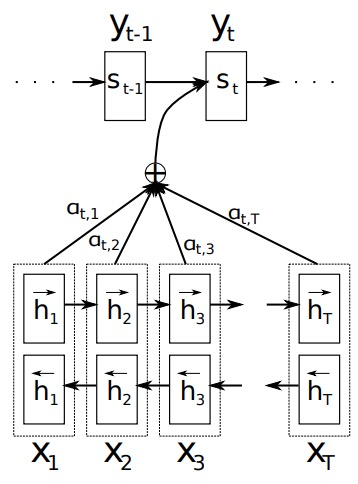

# Neural Machine Translation by Jointly Learning to Align and Translate

## 简介

在传统的RNN Encoder-Decoder模型中，在编码的过程中，将$$t-1$$时的状态$$h_{<t-1>}$$和$$t$$时刻的数据$$x_{<t>}$$输入到$$t$$时刻的RNN单元中，得到$$t$$时刻的状态$$h_{<t>}$$，经过$$T$$个时间片后，得到长度等于隐节点数量的特征向量$$\mathbf{c}$$。在解码的过程中，将特征向量$$\mathbf{c}$$和上个时间片预测的输出$$y_{<t'-1>}$$输入到RNN的单元中，得到该时刻的输出$$y_{<t'>}$$，经过$$T'$$个时间片后得到输出结果。但在一些应用中，比如句子长度特别长的机器翻译场景中，传统的RNN Encoder-Decoder表现非常不理想。一个重要的原因是$$t'$$时刻的输出可能更关心输入序列的某些部分是什么内容而和其它部分是什么关系并不大。例如在机器翻译中，当前时间片的输出可能仅更注重原句子的某几个单词而不是整个句子。

这篇论文率先提出了Attention的思想，通过Attention机制，模型可以同时学习原句子和目标句子的对齐关系和翻译关系。在编码过程中，将原句子编码成一组特征向量的一个集合，在翻译时，每个时间片会在该集合自行选择特征向量的一个子集用于产生输出结果。

## 详解

在这篇论文中，作者也是使用的RNN Encoder-Decoder结构。不同于传统的方式，在编码过程中，作者使用的是双向RNN（bi-RNN），每个RNN单元使用的是GRU。在解码过程中，使用的是基于Attention的GRU结构。算法结构如图1：

### 1.1 Encoder

双向RNN含有正向和反向两个方向，对于含有$$T$$个时间片的源句子$$X^T = \{x_1, x_2, ..., x_T\}$$，正向的输入数据是$$x_1 \rightarrow x_1 \rightarrow ... \rightarrow x_T$$，第$$t$$个时间片的隐节点$$\vec{h}_t$$表示为

$$
\vec{h}_{<t>} = f(\vec{h}_{<t-1>}, x_{<t>})
$$

反向数据的输入序列是$$x_T \rightarrow x_{T-1} \rightarrow ... \rightarrow x_1$$，第$$t$$个时间片的隐节点$$\vec{h}'_t$$表示为

$$
\vec{h}'_{<t>} = f(\vec{h}'_{<t+1>}, x_{<t>})
$$

其中$$f$$使用的是GRU的单元，详见上一篇论文的讲解。则第$$t$$个时间片的特征$$h_{<t>}$$是前向和后向两个特征向量拼接到一起。

$$
h_{<t>} = [\vec{h}_t; \vec{h}'_t]^T
$$

### 1.2 Decoder

在解码的过程中，传统的RNN Encoder-Decoder的方式将整个句子的特征向量作为输入

$$
s_{<t>} = f(s_{<t-1>}, y_{<t-1>}, c)
$$

Attention模型是使用所有特征向量的加权和，通过对特征向量的权值的学习，我们可以使用对当前时间片最重要的特征向量的子集$$c_i$$，即

$$
s_{<t>} = f(s_{<t-1>}, y_{<t-1>}, c_i)
$$

其中$$c_i$$是$$h_{<t>}$$的加权和

$$
c_i = \sum^{T}_{t=1} \alpha_{it}h_t
$$

$$
\alpha_{it} = \frac{exp(e_{it})}{\sum_{k=1}^Texp(e_{ik})}
$$

$$
e_{it} = a(s_{<i-1>}, h_t)
$$

其中$$e_{it}$$是输出序列第$$i$$个时间片的对齐模型，表示的是该时刻和输入数据每个时间片的相关程度。使用前一时刻的状态$$s_{<i-1>}$$和第$$t$$个输入数据$$h_t$$计算得到，在作者的实验中，$$a$$是使用的反正切tanh激活函数。

### 1.3 实验数据可视化

下图是通过可视化四组平行语料的$$\alpha$$值得到的图，$$\alpha$$值越大，表示两个数据相关性越强，图中的颜色越浅。

