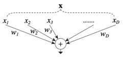
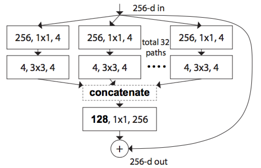
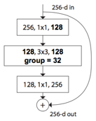

# Aggregated Residual Transformations for Deep Neural Networks

tags: ResNeXt, ResNet, Inception

## 前言

在这篇文章中，作者介绍了ResNeXt。ResNeXt是[ResNet](https://senliuy.gitbooks.io/advanced-deep-learning/content/di-yi-zhang-ff1a-jing-dian-wang-luo/deep-residual-learning-for-image-recognition.html)和[Inception](https://senliuy.gitbooks.io/advanced-deep-learning/content/di-yi-zhang-ff1a-jing-dian-wang-luo/going-deeper-with-convolutions.html)的结合体，不同于[Inception v4](https://senliuy.gitbooks.io/advanced-deep-learning/content/di-yi-zhang-ff1a-jing-dian-wang-luo/di-yi-zhang-ff1a-jing-dian-wang-luo/deep-residual-learning-for-image-recognition.html)的是，ResNext不需要人工设计复杂的Inception结构细节，而是每一个分支都采用相同的拓扑结构。ResNeXt的本质是[分组卷积（Group Convolution）](https://senliuy.gitbooks.io/advanced-deep-learning/content/di-yi-zhang-ff1a-jing-dian-wang-luo/di-yi-zhang-ff1a-jing-dian-wang-luo/di-yi-zhang-ff1a-jing-dian-wang-luo/mobilenetxiang-jie.html){{"howard2017mobilenets"\|cite}}，通过变量**基数（Cardinality）**来控制组的数量。组卷机是普通卷积和深度可分离卷积的一个折中方案，即每个分支产生的Feature Map的通道数为$$n (n>1)$$。

## 1. 详解

### 1.1 从全连接讲起

给定一个$$D$$维的输入数据$$\mathbf{x} = [x_1, x_2, ..., x_d]$$，其输入权值为我$$\mathbf{w} = [w_1, w_2, ..., w_n]$$，一个没有偏置的线性激活神经元为：

$$
\sum_{i=1}^D w_i x_i
$$

它的结构如图1所示。

 图1：全连接的split-transform-merge结构

这是一个最简单的“split-transform-merge”结构，具体的讲图1可以拆分成3步：

1. Split：将数据$$\mathbf{x}$$split成$$D$$个特征；
2. Transform：每个特征经过一个线性变换；
3. Merge：通过单位加合成最后的输出。

### 1.2 简化Inception

Inception是一个非常明显的“split-transform-merge”结构，作者认为Inception不同分支的不同拓扑结构的特征有非常刻意的人工雕琢的痕迹，而往往调整Inception的内部结构对应着大量的超参数，这些超参数调整起来是非常困难的。

所以作者的思想是每个结构使用相同的拓扑结构，那么这时候的Inception（这里简称简化Inception）表示为

$$
\mathcal{F} = \sum_{i=1}^C \mathcal{T}_i(\mathbf{x})
$$

其中$$C$$是简Inception的基数\(Cardinality\)，$$\mathcal{T}_i$$是任意的变换，例如一系列的卷积操作等。图2便是一个简化Inception，其$$\mathcal{T}$$是由连续的卷积组成（$$1\times1$$-&gt;$$3\times3$$-&gt;$$1\times1$$）。

 图2：简单Inception的split-transform-merge结构

### 1.3 ResNeXt

结合强大的残差网络，我们得到的便是完整的ResNeXt，也就是在简化Inception中添加一条short-cut，表示为：

$$
\mathbf{y} = \mathbf{x} + \sum_{i=1}^C\mathcal{T}_i(\mathbf{x})
$$

如图3所示：

 图3：ResNeXt结构

到这里我们发现ResNeXt和Inception v4是非常像的。不同之处有两点：

1. ResNeXt的分支的拓扑结构是相同的，Inception V4需要人工设计；
2. ResNeXt是先进行$$1\times1$$卷积然后执行单位加，Inception V4是先拼接再执行$$1\times1$$卷积，如图4所示。

 图4：Inception V4拼接在前的结构

### 1.4 分组卷积

分组卷积的雏形更早要追溯到2012年深度学习鼻祖文章AlexNet 。受限于当时硬件的限制，作者不得不将卷积操作拆分到两台GPU上运行，这两台GPU的参数是不共享的。

 图5：AlexNet

分组卷积是介于普通卷积核深度可分离卷积的一种折中方案，不是彻底的将每个channel都要单独赋予一个独立的卷积核也不是整个Feature Map使用同一个卷积核。

除了Inception v4，分组卷积的第三种变形是将开始的$$1\times1$$卷积也合并到一起，如图6。

 图6：分组卷积的第三种形式

## 总结

ResNeXt提出了一种介于普通卷积核深度可分离卷积的这种策略：分组卷积，他通过控制分组的数量（基数）来达到两种策略的平衡。分组卷积的思想是源自Inception，不同于Inception的需要人工设计每个分支，ResNeXt的每个分支的拓扑结构是相同的。最后再结合残差网络，得到的便是最终的ResNeXt。

从上面的分析中我们可以看书ResNeXt的结构非常简单，但是其在ImageNet上取得了由于相同框架的残差网络，也算是Inception直接助攻了一把吧。

ResNeXt确实比Inception V4的超参数更少，但是他直接废除了Inception的囊括不同感受野的特性仿佛不是很合理，在更多的环境中我们发现Inception V4的效果是优于ResNeXt的。类似结构的ResNeXt的运行速度应该是优于Inception V4的，因为ResNeXt的相同拓扑结构的分支的设计是更符合GPU的硬件设计原则。

