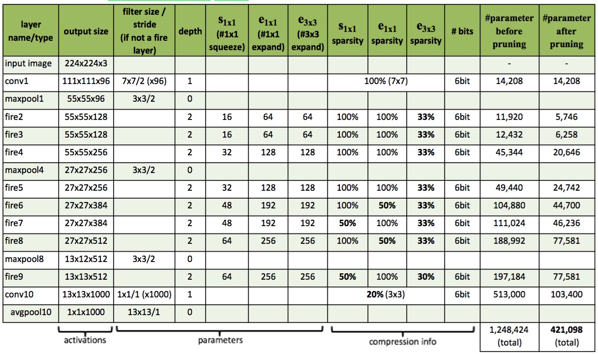

# SQUEEZENET: ALEXNET-LEVEL ACCURACY WITH 50X FEWER PARAMETERS AND &lt;0.5MB MODEL SIZE

tags: AlexNet, SqueezeNet

## 前言

从LeNet5到DenseNet，反应卷积网络的一个发展方向：提高精度。这里我们开始另外一个方向的介绍：**在大幅降低模型精度的前提下，最大程度的提高运算速度**。

提高运算所读有两个可以调整的方向：

1. 减少可学习参数的数量；
2. 减少整个网络的计算量。

这个方向带来的效果是非常明显的：

1. 减少模型训练和测试时候的计算量，单个step的速度更快；
2. 减小模型文件的大小，更利于模型的保存和传输；
3. 可学习参数更少，网络占用的显存更小。

SqueezeNet正是诞生在这个环境下的一个精度的网络，它能够在ImageNet数据集上达到[AlexNet](https://senliuy.gitbooks.io/advanced-deep-learning/content/di-yi-zhang-ff1a-jing-dian-wang-luo/imagenet-classification-with-deep-convolutional-neural-networks.html)近似的效果，但是参数比AlexNet少50倍，结合他们的模型压缩技术 Deep Compression，模型文件可比AlexNet小510倍。

## 1. SqueezeNet 详解

### 1.1 SqueezeNet的压缩策略

SqueezeNet的模型压缩使用了3个策略：

1. 将$$3\times3$$卷积替换成$$1\times1$$卷积：通过这一步，一个卷积操作的参数数量减少了9倍；
2. 减少$$3\times3$$卷积的通道数：一个$$3\times3$$卷积的计算量是$$3\times3\times M \times N$$（其中$$M$$，$$N$$分别是输入Feature Map和输出Feature Map的通道数），作者任务这样一个计算量过于庞大，因此希望将$$M$$，$$N$$减小以减少参数数量；
3. 将降采样后置：作者认为较大的Feature Map含有更多的信息，因此将降采样往分类层移动。注意这样的操作虽然会提升网络的精度，但是它有一个非常严重的缺点：即会增加网络的计算量。

### 1.2 Fire模块

SqueezeNet是由若干个Fire模块结合卷积网络中卷积层，降采样层，全连接等层组成的。一个Fire模块由Squeeze部分和Expand部分组成（注意区分和Momenta的[SENet](https://senliuy.gitbooks.io/advanced-deep-learning/content/di-yi-zhang-ff1a-jing-dian-wang-luo/squeeze-and-excitation-networks.html)的区别）。Squeeze部分是一组连续的$$1\times1$$卷积组成，Expand部分则是由一组连续的$$1\times1$$卷积和一组连续的$$3\times3$$卷积cancatnate组成，因此$$3\times3$$卷积需要使用same卷积，Fire模块的结构见图1。在Fire模块中，Squeeze部分$$1\times1$$卷积的**通道**数记做$$s_{1x1}$$，Expand部分$$1\times1$$卷积和$$3\times3$$卷积的**通道**数分别记做$$e_{1x1}$$和$$e_{3x3}$$（论文图画的不好，不要错误的理解成卷积的层数）。在Fire模块中，作者建议$$s_{1x1} < e_{1x1} + e_{3x3}$$，这么做相当于在两个$$3\times3$$卷积的中间加入了瓶颈层，作者的实验中的一个策略是$$s_{1x1} = \frac{e_{1x1}}{4} = \frac{e_{3x3}}{4}$$。图1中$$s_{1x1}=3$$，$$e_{1x1} = e_{3x3} = 4$$。

 图1：SqueezeNet的Fire模块

下面代码片段是Keras实现的Fire模块，注意拼接Feature Map的时候使用的是Cancatnate操作，这样不必要求$$e_{1x1} = e_{3x3}$$。

```python
def fire_model(x, s_1x1, e_1x1, e_3x3, fire_name):
    # squeeze part
    squeeze_x = Conv2D(kernel_size=(1,1),filters=s_1x1,padding='same',activation='relu',name=fire_name+'_s1')(x)
    # expand part
    expand_x_1 = Conv2D(kernel_size=(1,1),filters=e_1x1,padding='same',activation='relu',name=fire_name+'_e1')(squeeze_x)
    expand_x_3 = Conv2D(kernel_size=(3,3),filters=e_3x3,padding='same',activation='relu',name=fire_name+'_e3')(squeeze_x)
    expand = merge([expand_x_1, expand_x_3], mode='concat', concat_axis=3)
    return expand
```

图2是使用Keras自带的`plot_model`功能得到的Fire模块的可视图，其中$$s_{1x1} = \frac{e_{1x1}}{4} = \frac{e_{3x3}}{4}=16$$。

 图2：Keras可视化的SqueezeNet的Fire模块

### 1.3 SqueezeNet的网络架构

图3是SqueezeNet的几个实现，左侧是不加short-cut的SqueezeNet，中间是加了short-cut的，右侧是short-cut跨有不同Feature Map个数的卷积的。还有一些细节图3中并没有体现出来：

1. 激活函数默认都使用ReLU；
2. fire9之后接了一个rate为0.5的dropout；
3. 使用same卷积。

 图3：SqueezeNet网络结构

表1给出了SqueezeNet的详细参数：

 表1：SqueezeNet网络参数

根据表1，我们的Keras实现如下面代码片段：

```python
def squeezeNet(x):
    conv1 = Conv2D(input_shape = (224,224,3), strides = 2, filters=96, kernel_size=(7,7), padding='same', activation='relu')(x)
    poo1 = MaxPool2D((2,2))(conv1)
    fire2 = fire_model(poo1, 16, 64, 64,'fire2')
    fire3 = fire_model(fire2, 16, 64, 64,'fire3')
    fire4 = fire_model(fire3, 32, 128, 128,'fire4')
    pool2 = MaxPool2D((2,2))(fire4)
    fire5 = fire_model(pool2, 32, 128, 128,'fire5')
    fire6 = fire_model(fire5, 48, 192, 192,'fire6')
    fire7 = fire_model(fire6, 48, 192, 192,'fire7')
    fire8 = fire_model(fire7, 64, 256, 256,'fire8')
    pool3 = MaxPool2D((2,2))(fire8)
    fire9 = fire_model(pool3, 64, 256, 256,'fire9')
    dropout1 = Dropout(0.5)(fire9)
    conv10 = Conv2D(kernel_size=(1,1), filters=1000, padding='same', activation='relu')(dropout1)
    gap = GlobalAveragePooling2D()(conv10)
    return gap
```

上面的代码，模型的summary，以及SqueezeNet的keras可视化见：[https://github.com/senliuy/CNN-Structures/blob/master/SqueezeNet.ipynb](https://github.com/senliuy/CNN-Structures/blob/master/SqueezeNet.ipynb)。

### 1.4 SqueezeNet的性能以及Deep Compression

图3左侧的SqueezeNet的性能（top1：57.5%，top5：80.3%）是可以类似AlexNet的（top1：57.2%，top5：80.3%）。从表1中我们可以看出SqueezeNet总共有1,248,424个参数，同性能的AlexNet则有58,304,586个参数（主要集中在全连接层，去掉之后有3,729,472个）。使用他们提出的Deep Compression\[3\]算法压缩后，模型的参数数量可以降到421，098个。

## 2. 总结

SqueezeNet的压缩策略是依靠将$$3\times3$$卷积替换成$$1\times1$$卷积来达到的，其参数数量是等性能的AlexNet的2.14%。从参数数量上来看，SqueezeNet的目的达到了。SqueezeNet的最大贡献在于其开拓了模型压缩这一方向，之后的一系列文章也就此打开。

这里我们着重说一下SqueezeNet的缺点：

1. SqueezeNet的侧重的应用方向是嵌入式环境，目前嵌入式环境主要问题是实时性。SqueezeNet的通过更深的深度置换更少的参数数量虽然能减少网络的参数，但是其丧失了网络的并行能力，测试时间反而会更长，这与目前的主要挑战是背道而驰的；
2. 论文的题目非常标题党，虽然纸面上是减少了50倍的参数，但是问题的主要症结在于AlexNet本身全连接节点过于庞大，50倍参数的减少和SqueezeNet的设计并没有关系，考虑去掉全连接之后3倍参数的减少更为合适。
3. SqueezeNet得到的模型是5MB左右，0.5MB的模型还要得益于Deep Compression。虽然Deep Compression也是这个团队的文章，但是将0.5这个数列在文章的题目中显然不是很合适。

