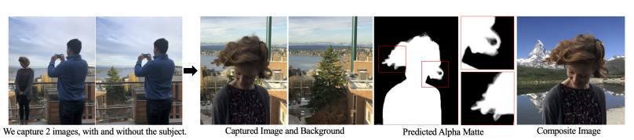
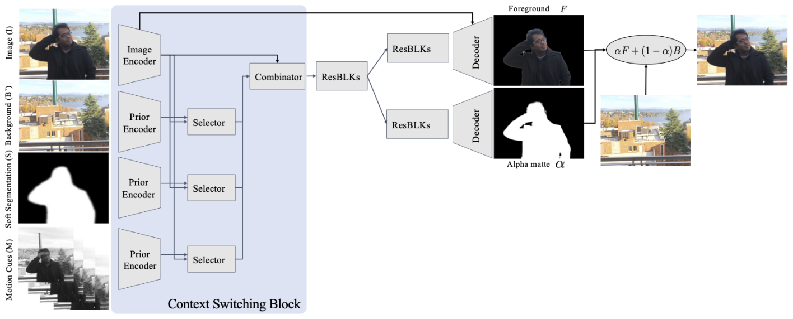

# Background Matting： The World is Your Green Screen

## 前言

使用人工智能技术实现类似PhotoShop等工具的抠图功能是一个非常有趣且有科研前景的一个方向。和分割算法只有$$0$$和$$1$$两个值相比，抠图得到的边缘更加平滑和自然，且包含透明通道信息。抠图方法可以概括为：$$\text{I} = \alpha \text{F} +（1-\alpha）\text{B}$$。其中$$\text{I}$$是输入图像，$$\text{F}$$表示图像$$\text{I}$$的的前景，$$\text{B}$$表示背景，$$\alpha$$表示该像素为前景的概率，Matting通常是指由图像内容和用户提供的先验信息来推测$$\text{F}$$， $$\text{B}$$以及$$\alpha$$。从技术角度来讲，抠图有传统方法和深度学习方法两种；从交互方式来看，抠图包括有交互和无交互两种，有交互的抠图通常需要用户手动提供一个草图（Scratch）或者一个三元图（Trimap）。这篇文章要介绍的是一篇基于深度学习的无交互的抠图方法，在目前所有的无交互的抠图算法中，Background matting是效果最好的一个。它的特点是要求用户手动提供一张无前景的纯背景图，如图1所示，这个方法往往比绘制三元图更为简单，尤其是在视频抠图方向 。这个要求虽然不适用于所有场景，但在很多场景中纯背景图还是很容易获得的。



在训练模型时，用户首先使用Adobe开源的包含alpha通道数据的数据集进行数据合成，然后在合成数据上进行有监督的训练。为了提升模型在真实场景中的泛化能力，由于这种数据往往都是无标签的。所以Background Matting使用一个判断图像质量的判别器来对无标签的真实场景的数据进行训练。源码已开源[Background-Matting](https://github.com/senguptaumd/Background-Matting)。

## 1. 算法详解



如图2所示，Background Matting的创新点有三个：

* 输入使用了背景图，分割结果，连续帧（视频）作为先验信息；
* 提出了Context Switching Block模块用于整合上面的数据；
* 提出了半监督的学习方式来提升模型的泛化能力。

下面将对以下三点详细展开。

### 1.1 网络结构

#### 1.1.1 输入

从图1中我们可以看出，Background Matting共有四个输入，其中 Input（$$I$$）和Background（$$B'$$）比较好理解，就是使用同一台拍摄设备在同一个环境下拍摄的有人和无人的两张照片。在尝试该算法的过程中，发现一个重要的一点是当拍摄照片时，要保证Input的背景和无人的Background的内容保持一致，要尽量避免阴影和反射现象的出现。

Soft Segmentation（$$S$$）是由分割算法得到的掩码图，论文中的分割算法使用的是Deep Labv3+，它使用类似于其它生成三元图的类似的方法来进行处理，包括10次腐蚀，5次膨胀以及一次高斯模糊。这一部分在`test_background-matting_image.py`的141-143行。

```python
rcnn = cv2.erode(rcnn, kernel_er, iterations=10)
rcnn = cv2.dilate(rcnn, kernel_dil, iterations=5)
rcnn=cv2.GaussianBlur(rcnn.astype(np.float32),(31,31),0)
```

Motion Cuses（$$M$$）是在处理视频时当前帧的前后各两帧，即$$M \equiv \{I_{-2T}, I_{-T}, I_{+T}, I_{+2T}\}$$，这些帧转化为灰度图后合成一个batch形成$$M$$。

#### 1.1.2 生成模型

Background Matting可以看做一个‘编码器-解码器’的结构，其中编码器又叫做Context Switching Block，它是由**Encoder**，**Selector**以及**Combinator**组成，下面结合源码对齐细节进行介绍。

**Encoder**：在Encoder中，四个输入图像将会被编码成不同的Feature Map，网络结构的细节可以去`network.py`文件去查看。其中输入图像的网络结构在18-20行：

```python
model_enc1 = [nn.ReflectionPad2d(3),nn.Conv2d(input_nc[0], ngf, kernel_size=7, padding=0,bias=use_bias), norm_layer(ngf), nn.ReLU(True)]
model_enc1 += [nn.Conv2d(ngf , ngf * 2, kernel_size=3,stride=2, padding=1, bias=use_bias),norm_layer(ngf * 2),nn.ReLU(True)]
model_enc2 = [nn.Conv2d(ngf*2 , ngf * 4, kernel_size=3,stride=2, padding=1, bias=use_bias),norm_layer(ngf * 4),nn.ReLU(True)]
```

它是由一个镜面padding（用于提升模型在边界处的抠图效果），连续3组步长为2的卷积，BN，ReLU组成，最终得到的Feature Map的尺寸是$$256\times\frac{W}{4}\times\frac{H}{4}$$，这个Feature Map即是源码中的`img_feat`。另外三个图像$$B$$，$$S$$，$$M$$和输入图像的编码器的结构相同，具体代码见23-44行，它们编码之后的Feature Map依次是`back_feat`，`seg_feat`以及`multi_feat`。

**Selector**：图1中另外一个重要的结构是Selector，它依次把`back_feat`，`seg_feat`以及`multi_feat`分别和`img_feat`拼接成一个Feature Map，然后经过三个结构相同的Selector得到三组和输入图像合并之后的Feature Map，它们依次是`comb_back`,`Comb_seg`以及`comb_multi`。Selector结构在源码的54-56行。

```python
self.comb_back=nn.Sequential(nn.Conv2d(ngf * mult*2,nf_part, kernel_size=1, stride=1, padding=0, bias=False), norm_layer(ngf), nn.ReLU(True))
self.comb_seg=nn.Sequential(nn.Conv2d(ngf * mult*2, nf_part, kernel_size=1, stride=1, padding=0, bias=False), norm_layer(ngf), nn.ReLU(True))
self.comb_multi=nn.Sequential(nn.Conv2d(ngf * mult*2, nf_part, kernel_size=1, stride=1, padding=0, bias=False), norm_layer(ngf), nn.ReLU(True))
```

**Combinator**：Combinator将三组Selector得到的结果`comb_back`,`Comb_seg`以及`comb_multi`和输入图像的编码结果`img_feat`拼接成一个Feature Map，拼接见源码的99和101行，网络结构为1组$$1\times1$$卷积+BN+ReLU的组合，得到的结果是`model_res_dec`，见源码的59行。

```python
model_res_dec=[nn.Conv2d(ngf * mult +3*nf_part, ngf*mult, kernel_size=1, stride=1, padding=0, bias=False), norm_layer(ngf*mult), nn.ReLU(True)]
...
oth_feat=torch.cat([self.comb_back(torch.cat([img_feat,back_feat],dim=1)),self.comb_seg(torch.cat([img_feat,seg_feat],dim=1)),self.comb_multi(torch.cat([img_feat,back_feat],dim=1))],dim=1)
out_dec=self.model_res_dec(torch.cat([img_feat,oth_feat],dim=1))
```

至此，Context Switching Block部分介绍完毕。

**共享残差**：紧跟着Context Switching Block的是一组7个残差模块组成的解码网络（60-61行）。残差模块定义在`ResnetBlock`类中，包括卷积，Dropout等操作，详见源码的204-244行。经过共享的解码结构之后，网络会分成两个分支的多头输出，它们分别用于前景$$F$$和概率通道$$\alpha$$的输出，我们下面对这两个分支分别进行介绍。

**前景预测分支**：在这个分支中，它首先将共享残差的解码经过一组3个残差块的解码器进行继续解码，得到名为`out_dec_fg`的Feature Map。解码的第一部分使用`out_dec_fg`作为输入，经过一组双线性差值上采样，卷积，BN,ReLU操作后得到`out_dec_fg1`。解码的第二部分使用`out_dec_fg1`和`img_feat`拼接之后的结果，依次经过双线性差值上采样，卷积，BN，ReLU，镜面Padding，卷积后得到`model_dec_fg2`。这一部分的核心代码如下：

```python
model_res_dec_fg=[]
for i in range(n_blocks2):
    model_res_dec_fg += [ResnetBlock(ngf * mult, padding_type=padding_type, norm_layer=norm_layer, use_dropout=use_dropout, use_bias=use_bias)]
...
model_dec_fg1=[nn.Upsample(scale_factor=2,mode='bilinear',align_corners = True),nn.Conv2d(ngf * 4, int(ngf * 2), 3, stride=1,padding=1),norm_layer(int(ngf * 2)),nn.ReLU(True)]
model_dec_fg2=[nn.Upsample(scale_factor=2,mode='bilinear',align_corners = True),nn.Conv2d(ngf * 4, ngf, 3, stride=1,padding=1),norm_layer(ngf),nn.ReLU(True),nn.ReflectionPad2d(3),nn.Conv2d(ngf, output_nc-1, kernel_size=7, padding=0)]
...
self.model_res_dec_fg=nn.Sequential(*model_res_dec_fg)
self.model_dec_fg1=nn.Sequential(*model_dec_fg1)
self.model_fg_out = nn.Sequential(*model_dec_fg2)
...
def forward(self, image,back,seg,multi):
    out_dec_fg=self.model_res_dec_fg(out_dec)
    out_dec_fg1=self.model_dec_fg1(out_dec_fg)
    fg_out=self.model_fg_out(torch.cat([out_dec_fg1,img_feat1],dim=1))
```

$$\alpha$$**预测分支**：和前景预测分支类似，它首先经过一组3个残差块的解码器进行继续解码，然后经过两组双线性差值，卷积，BN，ReLU操作进行解码，最后经过一组镜面Padding，卷积以及Tanh之后得到最终预测的alpha matte，使用Tanh的原因是因为alpha matte的每个像素的值需要介于0和1之间。这一部分的核心代码如下：

```python
model_res_dec_al=[]
for i in range(n_blocks2):
    model_res_dec_al += [ResnetBlock(ngf * mult, padding_type=padding_type, norm_layer=norm_layer, use_dropout=use_dropout, use_bias=use_bias)]
model_dec_al=[]
for i in range(n_downsampling):
    mult = 2**(n_downsampling - i)
    model_dec_al += [nn.Upsample(scale_factor=2,mode='bilinear',align_corners = True),nn.Conv2d(ngf * mult, int(ngf * mult / 2), 3, stride=1,padding=1),norm_layer(int(ngf * mult / 2)),nn.ReLU(True)]
    model_dec_al += [nn.ReflectionPad2d(3),nn.Conv2d(ngf, 1, kernel_size=7, padding=0),nn.Tanh()]
...
self.model_res_dec_al=nn.Sequential(*model_res_dec_al)
self.model_al_out=nn.Sequential(*model_dec_al)
...
def forward(self, image,back,seg,multi):
    out_dec_al=self.model_res_dec_al(out_dec)
    al_out=self.model_al_out(out_dec_al)
```

#### 1.1.3 判别模型

为了提升在真实场景的抠图效果，Background Matting使用了基于pix2pix hd中提出的多尺度判别器（注：论文中给出的是使用PatchGAN，源码的实现是基于多尺度判别器，两个算法大同小异，不影响Background Matting的整体框架，这里以源码为准）的对抗训练对真实场景的无标签数据进行训练。


在这里我们先对判别器模型结构进行介绍，训练方式见loss部分。判别器的网络结构位于`network.py`文件中的249行-340行。判别器的主类是`MultiscaleDiscriminator`，在多尺度判别器的每个尺度又使用了3个线性判别器。每个线性判别器都一个全卷积网络，由若干组卷积，BN和Leaky ReLU组成。判别器的3个尺度分别为：原图，原图的1/2，原图的1/4。不同尺度的判别器的优点在于越粗糙的尺度感受野越大，越容易判别全局一致性，而越精细的尺度感受野越小，越容易判别材质，纹理等细节信息。

### 1.2 模型训练

Background Matting使用了基于Adobe Matting Dataset的合成数据和无标签的真实数据的半监督方式进行模型训练，所以模型训练也氛围有监督学习部分和无监督学习部分。

#### 1.2.1 有监督学习

正如在1.1.1中介绍的，网络的输入 $$X$$ 由输入图像 $$I$$ ，无人像背景 $$B'$$ ，软分割效果 $$S$$ 以及运动信息 $$M$$ 构成，即 $$X \equiv \{I, B', S,M\}$$ 。在无视频的场景下， $$M$$ 由 $$I$$ 的灰度图组成。因此这个模型可以表示为：

$$
(F, \alpha) = G(X;\theta) \tag{1}
$$

其中 $$\theta$$ 是有监督学习需要学习的参数， $$G$$ 就是1.1.2中介绍的生成模型。

Adobe Matting数据集有450个前景图 $$F^*$$ 以及对应的alpha掩码 $$\alpha^*$$ 组成，这里选取了和人类比较类似的280个样本用于数据合成。背景则是取自于coco数据集。为了避免模型过于偏向于学习 $$I$$ 和 $$B’$$ 的差值，这里对 $$B'$$ 进行了一些变换得到 $$B$$ ，例如gamma矫正，高斯模糊等。 $$S$$ 是由DeepLab v3的输出经过10-20次的腐蚀以及15-30次的膨胀以及高斯模糊得到的。有监督学习的loss可以表示为：

$$
\min_{\theta_\text{adobe}} E_{X\sim p_{X}}[\|\alpha - \alpha ^ *\|_1 + \|\nabla(\alpha) - \nabla(\alpha^*)\|_1 + 2 \|F - F^*\|_1 + \|I - \alpha F - (1-\alpha) B\|_1], \tag{2}
$$

#### 1.2.2 对抗训练

基于1.2.1训练的数据都是基于合成的，但是只基于这些数据并无法得到非常好的人像抠图模型。难点有4个：

* 人像的细节非常难以处理；
* 分割效果如果不好的话对抠图的准确率影响很大；
* 前景和背景颜色接近时抠图很难；
* 有人像和无人像的背景图的对齐。

如果把失败的抠图效果合成到背景图中，这种生成的图像明显和真实拍摄的图像有很大的差距。基于这个思想，作者提出了使用对抗网络来进行网络参数的微调。也就是说，使用判别器来判断一个图片是合成的图像还是真实拍摄的图像，如果合成的图像足以骗过判别器，这就足以表明判别器优化到了一个比较好的参数值。也就是说，生成器生成的数据应最小化判别器判别的结果，这也就是对抗训练损失的第一个部分。

$$
loss_1 =  D(\alpha F + (1-\alpha)\bar{B} - 1)^2 \tag{3}
$$

如果只是端对端的对判别器和生成器进行训练，网络会容易陷入到处处$$\alpha=1$$的局部最优值。也就是说，生成网络只需要生成和输入图像完全一致的matting图，这时候判别器是无法判断一个图像是生成器生成的还是原始图像。

因此，Background Matting使用了在Adobe matting数据集上得到的模型作为指引来进行Teacher-Student学习，如图3所示。具体的讲，对于一个输入图像$$I$$以及与其对应的输入$$X$$，我们首先使用基于Adobe数据集训练的模型得到“伪Ground Truth”：$$(\tilde F, \tilde{\alpha}) = G(X; \theta_{\text{Adobe}})$$。然后我们使用真实数据训练一个基于真实数据的matting模型$$G(X; \theta_{\text{real}})$$。对抗训练的损失函数便是最小化Adobe数据集和真实数据集的差距。损失函数的最后便是根据预测的alpha和前景区域合成新的图像，然后最小化这个图像与输入图像的差值。

$$
loss_2 = 2\|\alpha - \tilde \alpha\|_1 + 4\|\nabla(\alpha) - \nabla(\tilde{\alpha})\|_1 + \|F-\tilde F\|_1 + \|I - \alpha - (1-\alpha)B'\|_1 \tag{4}
$$

综上，对抗训练的损失函数可以表示为最小化$$loss_1$$和$$loss_2$$之和：

$$
\min_{\theta_{\text{Real}}} \mathbb{E}_{X, \tilde B \sim p_{x, \tilde B}} (loss_1 + loss_2) \tag{5}
$$

### 1.3 测试

测试过程分成以下几步：

1. 根据输入数据$$I$$，准备对应的背景$$B'$$，软分割$$S$$，以及运动序列$$M$$。如果要处理的是图片，则用输入图像的复制代替；
2. 根据场景或者效果选择对应的抠图模型，作者提供了`syn-comp-adobe`，`real-fixed-cam`以及`real-hand-held`三个模型。
3. 根据模型的输出生成对应的效果图。

## 2. 总结

根据作者在附录中提供的内容，算法核心的每一个部分都起着非常重要的作用，似乎少了其中任何一个模块抠图效果都会大打折扣。算法的Context Switching Block的设计非常巧妙，利用GAN来进行半监督的学习提升在真实场景的数据也非常有意思，整个模型的算法非常精彩。

为了更好的使用该模型，作者在自己的博客中给出了若干条建议，首先是不要在生成的背景图和前景图区别过于大的环境下使用，包括动态的背景，会产生影子的区域，影响曝光的场景。这一部分的根本原因在于输入的$$B'$$和要预测的$$B$$差距过大，这一些变化的区域会被误识为前景区域。然后在进行拍摄时，作者建议关闭自动曝光和自动对焦，且使用摄影模式来拍摄有无人像区域，无背景的区域靠人离开拍摄区域来取得。所有这些的目的都是为了保持背景图片的一致性。

经过笔者尝试，虽然这个方法要求提供的数据最多，但它的最大优点是一个无交互的模型，而多的拍摄背景图的步骤远比手动绘制草图或者三元图的方式容易的多。在抠图效果上，它可以说是所有无交互模型中效果最好的，就算和绝大多数有交互的模型相比，它的效果也能排在前列。

Background Matting的另外一个好处是它提供了无监督的训练方式，使得用户可以根据自己的数据场景来训练自己的模型。这使用它有了更广泛的应用前景。


